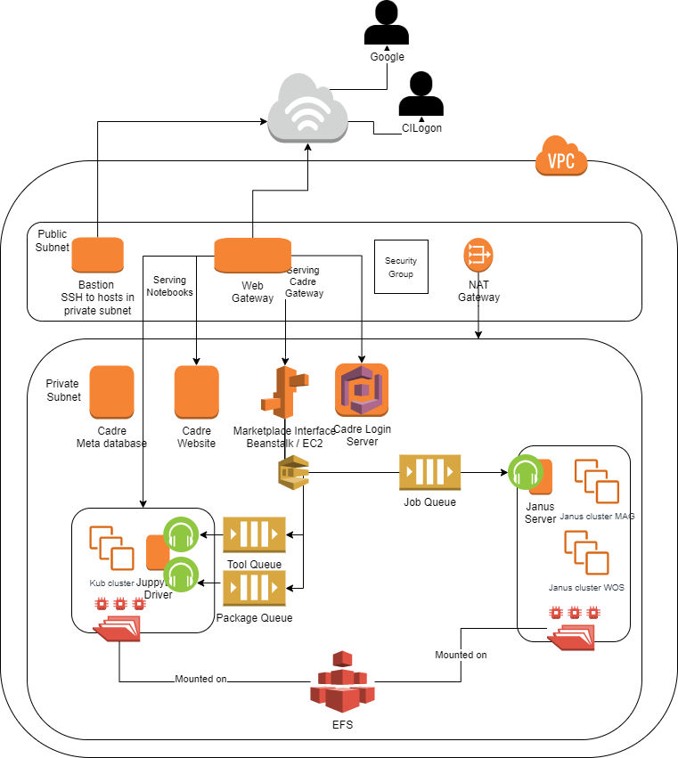

# **CADRE Technical Documentation**

## **Table of Contents**

- [CADRE Architecture Overview](#cadre-gateway-overview)
- [CADRE Glossary](#cadre-glossary)
- [CADRE backend components](#cadre-backend-components)
    - [Dev VPC and Production VPC](#dev-vpc-and-production-vpc)
    - [CADRE-federated-login system](#cadre-federated-login-system-fls)
    - [CADRE meta database](#cadre-meta-database)
    - [CADRE listeners](#cadre-listeners)
        - Job Listeners
        - Tool creation Listener
        - Package run Listener
    - [Notebooks](#notebooks)
    - [Kubernetes cluster](#kubernetes-cluster)
    - [Janus Graph](#janus-graph)
    - [CADRE Datasets](#cadre-datasets)
    - [AWS operations and services](#aws-operations-and-services)
- [Architecture Maintenance](#architecture-maintenance)
- [Wiki to other components](#wiki-to-other-components)
- [Contributors](#contributors)

## **CADRE Glossary**
### Abbreviations
- RAC - Research Assets Commons
- QI - Query Interface
- FLS - Federated Login System
- WoS - Web of Science (data set)
- MAG - Microsoft Academic Graph (data set)
- PTO - Patent and Trademark Office (data set)

### Terms
- Research Assets Commons - Marketplace where users can store and consume existing piplines of data and algorithms
- Notebook - method by which users can run custom code against CADRE data sets
- Query Interface - main interface where users can query CADRE data sets. Includes query builder and notebooks.
- Cadre Data Sets or just Data Sets - the main datasets (WoS, MAG, PTO) in all their database forms
- Data Subset - Result set of data that can be stored in RAC or used for further queries
- GraphQL - type of API that requires well formed JSON queries to fetch data rather than separate REST endpoints
- Data API - a web API that will act as a proxy so the QI can securely access the Cadre Data Sets
- CADRE Network - the network of cadre servers including API, Web, and Database servers.
- Server - Computer that is used to host microservices or databases. Can be actual nodes or VMs in a cloud solution
- Cadre Auth Token - an authentication token created by the FLS used to authenticate a user across the CADRE Network Servers

## **CADRE Gateway Overview**

The CADRE Gateway is a web-based interface that allows users to query large science of science data sets. A complex system of Amazon Web Services (AWS) services is used to allow the Gateway to function.

The entirety of the gateway is hosted on AWS and uses various services. We use a Virtual Private Cloud with two subnets to separate public facing code from the databases, AWS services, and system level code. The private subnet is only accessible through an SSH bastion or an Apache web server found in the public subnet.

The user interface uses an AWS service called Elastic Beanstalk that allows code to be run without having to manage a web server manually. The interface uses a frontend primarily written using Vue.js and a backend that uses Python to connect to databases and expose API endpoints.

Users log into the system using a third-party service called CILogon. CILogon is a federated login system that allows users to log in using their university account (or Gmail). Upon logging in, the user’s data (name, email, institution, etc.) is sent to the CADRE servers so that the Gateway can generate all required metadata, permissions, and folders in the system. We also create entries in AWS Cognito, to further handle permissions and login duties. Cognito is an AWS service that handles user pools and makes it easier to manage user permissions within the AWS ecosystem.

To reduce the cost of the VMs, we temporarily suspend these VMs unless a dataset is being actively queried, so the cost is dependent on usage. Adding more datasets, or version of datasets, would require another 5-node cluster for each dataset supported.

When a query is submitted from the Gateway interface, a message is added to a queue running on AWS’s Simple Queue Service (SQS). A “listener” EC2 VM watches this queue, and when it sees that a user has submitted a query, it will start the cluster and run the query against the chosen JanusGraph database. Once completed, the results will be saved to a user’s personal space on the AWS Elastic File System (EFS). Users can then use a Jupyter notebook to open these files and do postprocessing on the data.

Like the datasets’ EC2 VMs, a user’s Jupyter notebook is not always running to save on cost. We use another cluster of EC2 VMs managed by Kubernetes to create new Jupyter notebook servers on demand. When a user requests to open a notebook, Kubernetes will create a containerized Jupyter server and mount that user’s personal EFS space where they can access query results and personal scripts.

The Marketplace features use a similar Kubernetes/SQS system. To create a package that can automatically run tools and reproduce results, users need to archive datasets and register tools with the system. When a user archives a dataset (query results), the .csv result files will be zipped and stored on AWS’s Simple Storage Service (S3). When a package is run, this archived dataset will be downloaded to the running user’s EFS storage space so that a tool can be run against it.

Creating a tool is a little more complex. A user will create a python script in their Jupyter notebook. After choosing to create a tool, the user can choose one or more python files to include in the tool. A message will be sent to an SQS queue including the user and the files. A listener within the Kubernetes cluster will generate a Docker file and bundle the python scripts and docker file.

Creating a package is a matter of choosing an available tool and an available data archive. The information is saved to a database and made available to users through the marketplace. When a user runs a package, a message is again put on an SQS queue. A listener will watch for a message and download the tool and dataset to a user’s EFS space. A docker container is created and automatically run, using the tool scripts and the given archive. The resulting output is saved to the user’s EFS space and is viewable through the Jupyter notebook, just like query results.

## **CADRE backend components**

### Dev VPC and Production VPC
Dev/Prod VPC:
- Server geographic locations
- Prod: Ohio
- Dev: N. Virginia
- Note: Dev is not a Perfect replica of Prod (some resources in Prod are not in Dev)
- (**Add Machine Software Paths**)

### Public Subnet and Private Subnet
See [Production Subnet documention](https://github.com/iuni-cadre/cadre-wiki/wiki/Production-Subnet-Documentation) for full details (names, IP addresses, locations) on the resources for the public subset and private subnet.
- Public Subnet
    - Bastion:
        - Name: cadre-vpc-ohio-bastion
        - IP Public: `___`
        - IP Private: `___`
        - EBS Volume Name: cadre-vpc-ohio-bastion
            - Location: `/dev/xvda`
        - Desc: for SSH to hosts in Private subnet
            - Locations for SSH at: `/home/ec2-user`
    - Web Gateway:
        - Name: cadre-web-gateway
        - IP: `___`
        - EBS Volume Name: cadre-web-gateway
            - Location: `/dev/sda1`
        - Desc: Public access to website
- Private Subnet EC2 Machines:
    - Website:
        - Name: cadre-website
        - IP: `___`
        - EBS Volume Name: cadre-website
            - Location: `/dev/sda1`
        - Desc: the contents of the website
    - [Login Server](#cadre-federated-login-system-fls):
        - Name: cadre-login
        - IP: `___`
        - EBS Volume Name: cadre-login
            - Location: `/dev/sda1`
        - Cognito?
        - Desc: The Server handing logins
        - Path to cadre-login Repo
            - `/home/ubuntu/cadre-login`
    - [Meta Database](#cadre-meta-database):
        - Name: cadre-metadatabase
        - IP: `___`
        - EBS Volume Name: cadre-metadatabase
            - Location: `/dev/sda1`
        - Database Name: cadre_meta
        - Database user: cadre
        - Location to Repo
            - `/home/ubuntu/cadre-metadatabase`
    - [Graph Databases](#janus-graph):
        - Datasets: WoS, MAG, USPTO
        - Resources per Dataset:
            - 1 Janus Server
            - 1 Elastic Search Server
            - 3 Cassandra Nodes (1 seed and 2 nodes)
            - 1 Volume per resource above
    - [Kub/Jupyter](#kubernetes-cluster)
        - Name: jupyter-driver-1
        - IP: `___`
        - EBS Volume Name: jupyter-driver-1
            - Location: `/dev/sda1`
        - Cadre-job-listener path: /home/ubuntu/cadre-job-listener
    - Beanstalk
        - CadreInterface-env
        - Note: Elastic beanstalk tears down and spins up a new EC2 instance each time the interface is updated, so it's unlikely that the internal IP address will be the same every time.

### Cadre-federated-login system (FLS)
- Github [link](https://github.com/iuni-cadre/cadre-login)
- Both production and dev versions are deployed from master
- Use AWS cognito further handle permissions and login duties
    - AWS Cognito is an AWS service that handles user pools and makes it easier to manage user permissions within the AWS ecosystem.
    - Identity providers : CiLogon, Google
    - Client ids can be found in cognito console when select correct region
    - CILogon is added as third party OIDC
    - For CILogon, you need to add custom attributes in order to available them in the
    response
    - AWS manages the domain for login as well
        - `login.cadre.iu.edu` (dev version)
        - `login-1.cadre.iu.edu` (production version)
- Service restart
    - Managed by supervisor process
    - Logs : `/home/ubuntu/cadre-login/cadre_logging.log`
    - Config : `/home/ubuntu/cadre-login/conf/cadre.config`
    - Important configs :
        - [DEFAULT]
            - cadre_dashboard=https://cadre.iu.edu/gateway/?username=
        - [DATABASE_INFO] - Related to metadb
            - database-host=
            - database-port=
            - database-name=
            - database-username=
            - database-password=
        - [JUPYTERHUB]
            - jupyterhub-apihost=http://a2ac434e8f73511e9804d0a1687f12bb-9557104
            21.us-east-1.elb.amazonaws.com/jupyter/hub/api/
        - [AWS]
            - aws-access-key-id=
            - aws-secret-access-key=
            - region-name=
            - client-id=
            - redirect-uri=https://cadre.iu.edu/api/auth/cognito/callback
            - logout-redirect-uri=https://cadre.iu.edu
            - token-endpoint=https://login-1.cadre.iu.edu/oauth2/token
            - userinfo-endpoint=https://login-1.cadre.iu.edu/oauth2/userInfo

### Cadre meta database
- Github repo: [cadre-metadatabase](https://github.com/iuni-cadre/cadre-metadatabase)
    - [Meta database schema](https://github.com/iuni-cadre/cadre-metadatabase/blob/master/cadre-metadatabase.sql)
    - Need to run only once, if you create a new ec2 instance for meta database
- Name: cadre-metadatabase
        - IP: (found [here](https://github.com/iuni-cadre/cadre-wiki/wiki/Production-Subnet-Documentation))
        - EBS Volume Name: cadre-metadatabase
            - Location: `/dev/sda1`
        - Database Name: cadre_meta
        - Database user: cadre
        - Location to Repo
            - `/home/ubuntu/cadre-metadatabase`

### Cadre listeners
- Job Listeners
    - Job listeners are vastly different in production and dev versions
    - Production
        - Listeners running on jupyter hub driver instance
        - Login: SSH to production bastion
        - Run `ssh_to_jupyter`
        - Github [link](https://github.com/iuni-cadre/cadre-job-listener/tree/kub_run_packages) (Not from master)
        - Job queue [link](https://sqs.us-east-1.amazonaws.com/799597216943/cadre-job-listner-vp
        ceast1.fifo)
        - 16 job listeners are running via supervisor
        - All the logs are stored in: `/home/ubuntu/cadre-job-listener/cadre_tool_listener.log`
        - If you do changes to the python code, you need to restart supervisor
        processes
        - Make sure database connections are successful before starting the
        processes
        - EFS needs to be mounted
        - Job results are in: `/home/ubuntu/efs/home/cadre-query-results/{username in base32}/query-results`
    - Dev
        - WoS
            - Deployed from master, in jupyter driver ec2
            - Login: ssh to dev bastion and run `ssh_to_jupyter`
            - Github [link](https://github.com/iuni-cadre/cadre-job-listener/tree/master)
    - MAG Janus
        - Github [link](https://github.com/iuni-cadre/janus-job-listener/tree/mag-janus)
        - Deployed in Janus server ec2 instance from mag-janus branch
        - Login: ssh to dev bastion and run `ssh_to_janus_server_2_1`
        - Make sure EFS is mounted
        - Java application
        - Install Java 8, apache maven
        - Build :
            - `cd /home/ubuntu/janus-job-listener`
            - `mvn clean install`
        - Deploy
            - Once the build successful, copy generated jars from target dir
            - cp target/janus-job-listener-0.0.1-SNAPSHOT* ~/lib/
            - Kill the running nohup process and start the new process
                - `cd /home/ubuntu/janus-job-listener/bin`
                - `nohup sh start.sh > nohup.out &`
            - In the future, we should start this as supervised process
        - Logs: `/home/ubuntu/janus-job-listener/cadre-janus-job-listener.log`
        - Config: `/home/ubuntu/lib/cadre_config.properties`
- Tool creation Listener
    - This is called when user clicks create tool button from Marketplace
    - Tool info submitted to tool queue from cadre-interface
    - Queue urls:
        - [production](https://sqs.us-east-1.amazonaws.com/799597216943/cadre-tool-listner-v
    pceast1.fifo)
        - [dev](https://sqs.us-east-2.amazonaws.com/799597216943/cadre-tool-queue.fif
    o)
    - Create a docker image and upload to docker hub
        - Github [link](https://github.com/iuni-cadre/cadre-wiki/wiki/Run-packages-with-Kubernetes)
    - Run on jupyter driver ec2 instance
    - Make sure kubernetes, docker installed
    - Make sure you can pull images from cadre docker repository without prompting
    to get username and password. Follow the [link](https://github.com/iuni-cadre/cadre-wiki/wiki/Docker) in the private wiki document.
    - Logs: `/home/ubuntu/cadre-job-listener/cadre_tool_listener.log`
- Package run Listener
    - This is called when user clicks on run package
    - Package creation does not associate with the listener. It only adds database
    entries to the meta database
    - Package run information submitted to the queue from cadre-interface middleware
    - Queue urls:
        - [production](https://sqs.us-east-1.amazonaws.com/799597216943/cadre-package-listn
    er-vpceast1.fifo)
        - [dev](https://sqs.us-east-2.amazonaws.com/799597216943/cadre-package.fifo)
    - When submit package run, we first get the tool id for the package from metadb,
    and pull the docker image with tool_id as the tag from dockerhub, cadre
    repository
    - Package run as a pod in kubernetes, you can run kubernetes commands to see
    whether the package run successfully
        - `kubectl get pods -n jhub`
        - `kubectl logs -n jhub <pod_id>`
    - Pods with completed or failed will be deleted when the next package run
    - Logs: `/home/ubuntu/cadre-job-listener/cadre_package_listener.log`
- Configs
    - Except for Janus job listener, for all the other listeners, config file located in:
    `/home/ubuntu/cadre-job-listener/conf/cadre.config`
    - It contains configs related to all the listeners

### Notebooks
- For notebooks, we use jupyterhub
- Installation and other userful info can be found [here](https://zero-to-jupyterhub.readthedocs.io/en/latest/amazon/step-zero-aws.html)
- Details about configs and instructions found [here](https://github.com/iuni-cadre/cadre-notebooks)
- We use [jupyter REST API](https://jupyterhub.readthedocs.io/en/stable/reference/rest.html) to generate tokens and create notebook servers for users
- Admin username is IUNITester, if you need an admin token, you need to navigate to the
admin panel and create an api token. We have created admin tokens and they are used
in cadre-interface middleware. If you revoke api tokens, you need to redeploy the Elastic
beanstalk instance with a new api key.
- `Config.yml` can be found in the jupyter driver home directory.
- To redeploy jupyterhub
    - `helm upgrade -f config.yaml jhub jupyterhub/jupyterhub --version=0.8.2`

### Kubernetes cluster
- Both production and dev vpcs, contains kubernetes cluster with 1 master, 4 nodes and
one driver node
- Production cluster configured to auto scale according to the load, dev is not yet
configured.
- To run all the kubernetes operations, you need to login to driver node. (using
`ssh_to_jupyter` from bastion)
- `kops` commands use to update the cluster, node configurations etc.
- [Run packages with Kubernetes](https://github.com/iuni-cadre/cadre-wiki/wiki/Run-packages-with-Kubernetes)
- Kub/Jupyter
    - Name: jupyter-driver-1
    - IP: (found [here](https://github.com/iuni-cadre/cadre-wiki/wiki/Production-Subnet-Documentation))
    - EBS Volume Name: jupyter-driver-1
        - Location: `/dev/sda1`
    - Cadre-job-listener path: /home/ubuntu/cadre-job-listener

### Janus Graph
- Janus cluster only available in ohio vpc
- Datasets: WoS, MAG, USPTO
- Running cluster includes
    - 1 Janus Server
    - 1 elastic search server
    - 3 cassandra nodes (1 seed + 2 nodes)
    - 1 Volume per resource above
- Start janus server
    - ssh to janus server instance
    - Kill the running nohup process
    - `cd janusgraph, run nohup bin/gremlin-server.sh`
    - `conf/gremlin-server/socket-http-gremlin-server.yaml > janus.out &`
- Data pipeline and provenance for CADRE
    - Github [link](https://github.com/iuni-cadre/DataPipelineAndProvenanceForCADRE) to the official public repo for the data pipeline and provenance for CADRE

### Cadre Datasets
- Separate EC2 instances for MAG and WoS
- Each ec2 instance contains postgres DB and neo4j DB
- Each should have EFS mounted

### AWS operations and services
- VPCs
    - [Design](https://github.com/iuni-cadre/cadre-wiki/wiki/Create-new-VPC-for-Cadre)
    - 2 VPCs
    - Dev - Ohio region
    - Production - Virginia region
- Security groups
    - 2 main security groups defined for each vpc
    - `cadre-vpc-pub-sg` - for public facing ec2 instances
    - `cadre-backend-sg` - for private ec2 instances
    - Always try to use one of the above security groups if you want to add new ec2
    instances
- SQS (Simple Queue Service)
    - Cadre-janus-queue.fifo
    - Cadre-job-queue.fifo
    - Cadre-package.fifo
    - Cadre-startstop
    - Cadre-tool-queue.fifo
- [Amazon Elastic File System](https://github.com/iuni-cadre/cadre-wiki/wiki/Amazon-Elastic-File-System) (File Storage)
    - EFS-Ohio
    - Size: 115.83GiB
- [Amazon S3](https://github.com/iuni-cadre/cadre-wiki/wiki/Amazon-S3)
- [AWS Services For Creating Docker Images](https://github.com/iuni-cadre/cadre-wiki/wiki/AWS-Services-For-Creating-Docker-Images)
- Cognito
    - Cannot find resource/service
- AWS Managing Instances script on ssh_to_janus_server_uspto_2021
    - Sudo supervisorctl to see status of cadre-start-jg-listener
    - Crontab -e to view the automation and path to script
        - Path to python environment: `/home/ubuntu/cloud-admin/venv/bin/activate`
        - Path to idle checker: `/home/ubuntu/cloud-admin/aws/idle_checker/idle_checker.py`
        - Path to (???): `/aws/ec2 januscluster start python script`

## Architecture Maintenance
Because of the large amount of data, we need to use some of the larger VMs available, which can cost upwards of $20,000 in total, per month. To bring this cost down to around $5,000 - $7,000 per month, we temporarily suspend these VMs unless a dataset is being actively queried, so the cost is dependent on usage. Adding more datasets, or version of datasets, would require another 5-node cluster for each dataset supported.

## Wiki to other components
- [API Endpoints](https://github.com/iuni-cadre/cadre-wiki/wiki/API-Endpoints)
- [Create new VPC for Cadre](https://github.com/iuni-cadre/cadre-wiki/wiki/Create-new-VPC-for-Cadre)
- [Data Consistency and Data Pipeline Issues](https://github.com/iuni-cadre/cadre-wiki/wiki/Data-Consistency-and-Data-Pipeline-Issues)
- [Database Fields That Need To Be Indexed For Rome](https://github.com/iuni-cadre/cadre-wiki/wiki/Database-Fields-That-Need-To-Be-Indexed-For-Rome)
- [Development VM Shut Down Policy](https://github.com/iuni-cadre/cadre-wiki/wiki/Development-VM-Shut-Down-Policy)
- [Docker](https://github.com/iuni-cadre/cadre-wiki/wiki/Docker)
- [Keys](https://github.com/iuni-cadre/cadre-wiki/wiki/Keys)
- [Lambda Functions](https://github.com/iuni-cadre/cadre-wiki/wiki/Lambda-Functions)
- [LogStash and ElasticSearch for Logging Administration Guide](https://github.com/iuni-cadre/cadre-wiki/wiki/LogStash-and-ElasticSearch-for-Logging-Administration-Guide)
- [Notebooks and Data Assets](https://github.com/iuni-cadre/cadre-wiki/wiki/Notebooks-and-Data-Assets)
- [Packages](https://github.com/iuni-cadre/cadre-wiki/wiki/Packages)
- [Policies and Permissions](https://github.com/iuni-cadre/cadre-wiki/wiki/Policies-and-Permissions)
- [Postgresql Copy command](https://github.com/iuni-cadre/cadre-wiki/wiki/Postgresql-Copy-command)
- [Resource Description Framework(RDF)](https://github.com/iuni-cadre/cadre-wiki/wiki/Resource-Description-Framework(RDF))
- [SNS Topics](https://github.com/iuni-cadre/cadre-wiki/wiki/SNS-Topics)
- [URLs](https://github.com/iuni-cadre/cadre-wiki/wiki/URLs)
- [Web of Science data schema](https://github.com/iuni-cadre/cadre-wiki/wiki/Web-of-Science-data-schema)

## Contributors

List contributors by handle or name (whichever appropriate)
Ben Serrette (@benabus); 